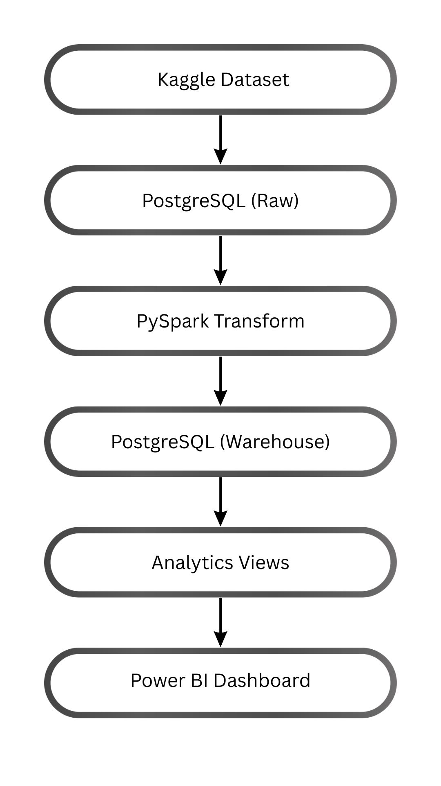

# Banking Transaction Analytics Pipeline

An end-to-end data pipeline that ingests a banking transactions dataset,
loads it into PostgreSQL, transforms it with PySpark, models it into a
star schema, and exposes analytics views for Power BI. Built to
demonstrate core data engineering skills: ingestion, data quality checks,
distributed transformation, dimensional modeling, and orchestration
(6.3M+ transaction rows).

<p align="center">
  
</p>

## What it answers

- How many transactions happen, and what's the total amount moved?
- Which customers transact the most?
- What percentage of transactions are fraud, and which type is riskiest?

Full list in [`docs/business_questions.md`](docs/business_questions.md).

## Pipeline

```text
Kaggle dataset
      |
      v
Create database + schemas
      |
      v
Profile raw data (data quality checks)
      |
      v
Load into PostgreSQL raw layer
      |
      v
PySpark transformations
      |
      v
Build warehouse (star schema)
      |
      v
Create analytics views
      |
      v
Power BI dashboard
```

More detail in [`docs/architecture.md`](docs/architecture.md).

## Tech stack

Python, PostgreSQL, PySpark, Apache Airflow (optional), Power BI, pytest.

## Folder structure

```text
banking-data-platform/
├── settings.py               # all settings, loaded from .env
├── run_pipeline.py           # runs the whole pipeline
├── pipeline/                 # one file per pipeline step
│   ├── db.py
│   ├── step1_create_database.py
│   ├── step2_create_schemas.py
│   ├── step3_profile_data.py
│   ├── step4_load_raw_data.py
│   ├── step5_transform_data.py
│   ├── step6_build_warehouse.py
│   └── step7_create_analytics_views.py
├── sql/
│   ├── schema/                # table definitions
│   └── analytics/              # reporting views
├── airflow/                  # optional scheduled orchestration
├── docs/                      # architecture, data dictionary, business questions
├── jars/                       # Postgres JDBC driver (see jars/README.md)
├── tests/                     # pytest tests
├── data/
│   ├── raw/                     # transactions.csv goes here (git-ignored)
│   ├── processed/                # git-ignored
│   └── reports/                  # data quality reports
├── .env.example
├── requirements.txt
└── README.md
```

## Setup

### Requirements

- Python 3.10+
- PostgreSQL 15
- Java 8 or 11 (for PySpark)

### 1. Install dependencies

```bash
python -m venv venv
source venv/bin/activate        # Windows: venv\Scripts\activate
pip install -r requirements.txt
```

### 2. Configure environment variables

```bash
cp .env.example .env
# fill in your Postgres password
```

### 3. Download the Postgres JDBC driver

```bash
curl -L -o jars/postgresql-42.7.3.jar \
  https://jdbc.postgresql.org/download/postgresql-42.7.3.jar
```

### 4. Add the dataset

Download the [PaySim dataset](https://www.kaggle.com/datasets/ealaxi/paysim1)
from Kaggle and place it at `data/raw/transactions.csv`.

### 5. Run the pipeline

```bash
python run_pipeline.py
```

Runs all 7 steps: creates the database, creates the schemas, profiles the
data, loads it, runs PySpark, builds the warehouse, creates analytics
views. Safe to re-run from the start if it fails partway through.

### 6. Connect Power BI

Point Power BI's Postgres connector at the `analytics` schema views
(`executive_summary`, `fraud_summary`, `customer_spend_summary`, etc.).

### 7. (Optional) Run through Airflow

```bash
cd airflow
export DB_HOST=host.docker.internal DB_PORT=5432 DB_NAME=banking_platform \
       DB_USER=postgres DB_PASSWORD=changeme
docker compose up
```

Airflow UI: `http://localhost:8080`. DAG: `banking_transaction_pipeline`.

## Tests

```bash
pytest
```

## Possible improvements

- Real-time ingestion (Kafka)
- Cloud deployment
- Automated data quality alerting
- ML-based fraud scoring

## License

MIT -- see [LICENSE](LICENSE).
